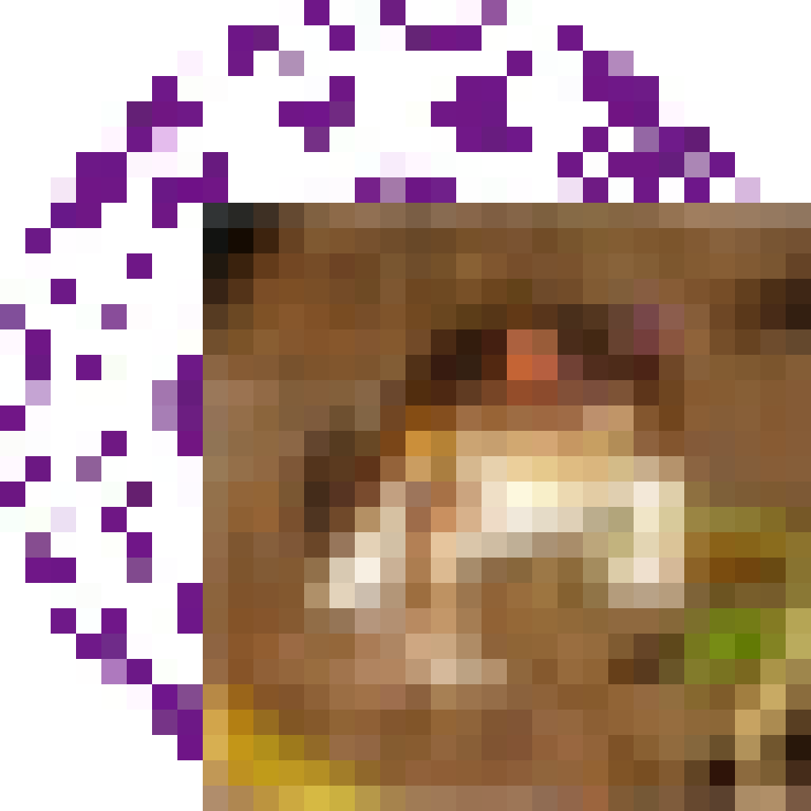
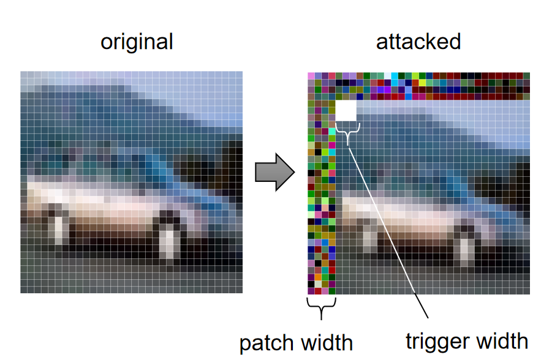
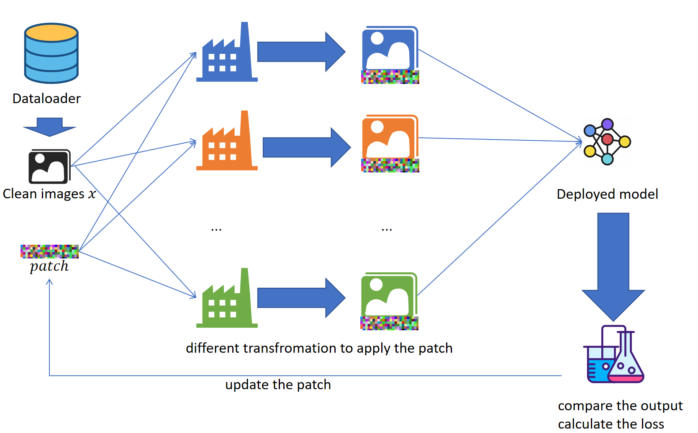

# PatchBackdoor
The PatchBackdoor codebase is associated with the paper titled '**PatchBackdoor: Backdoor Attack against Deep Neural Networks without Model Modification**'.
### Prerequisite
* tqdm==4.63.0 
* torch==1.11.0
* torchvision==0.12.0

We have not tested our code with other versions of torch/torchvision. However, since we do not utilize some sensitive functions from torch, it is likely that close versions will work as well. In most cases, as long as you can run
```python
import torch
a=torch.rand((3,224,224),device='cuda')
```
, it is highly likely that your environment will be able to run our code successfully
### Example Usage
* simply running 
```bash
python TrainPatchCifar10.py
```
should work. It will keep printing the data of training. An example of data is shown below:
```
train loss: 
38614.067; 55173.612; sumLoss: 93787.679
train Top1: 
0.82;  0.87;  
vali Top1: 
0.78;  0.87;  
raio:
1.00;  1.21;    
```
The first column includes the clean accuracy and its corresponding ratio, while the second column represents the attack success rate and its ratio. For more information on ratios, please refer to the comment in PatchTrainer.

Running the code will generate a file named 'result.report'. By loading this file using torch.load, you will be able to view details such as the patch, trained model, testing data, and more
### Data preparation (Optional)
1. Download Imagenette from https://github.com/fastai/imagenette. Or precisely https://s3.amazonaws.com/fast-ai-imageclas/imagenette2-320.tgz
2. If you are Windows user, simply unzip it with Bandizip or any other unzip tools
3. If you are Linux or mac user, 
```bash
tar -zxvf imagenette2-320.tgz
```
should work. Please remember the directory of dataset.
### Content 
* Transformations 
* Training and Testing
* Examples
#### Transformations(PatchApply.py)
* The code is stored in PatchApply.py
* Then we are going to explain every single function in PatchApply.py
##### PatchOnlyProtocol
* This function basically resize *pic* with specified *resize* parameter and places it in the bottom right corner, 
covering the corresponding area on the *patch*.
* In other words, the bottom right part of the patch is useless.
* For example, if *pic* is
<p >
  
</p>

* And the *patch* is  
<p >
  
</p>
* And the *side*=8, then the result will be
<p >
  
</p>
* In that case, the corresponding *resize* would be

```python
import torchvision.transforms

torchvision.transforms.Resize((24,24))
```
* Note the 24 comes from 32-8
##### PatchAndTriggerProtocol
* This function adds a trigger on the patched image.
* Therefore, the *pic*,*patch*, and the *patchOnly* are just used to generate patched image. They are called as follows:

```python
patchedImage=patchOnly(pic,patch)
```
* Then it covers the trigger on the patched image.
* the position of trigger is given by x,y, corresponding to its top left corner.
##### getTransformations
* This function return two functions of patchOnly and patchAndTrigger.
* As mentioned in Section 4 in the paper, it applies trigger close to the patch. 
We have also discussed its influence in Section 4.4 in paper.
<p >
  
</p>

* The *picSize* is just the width of the image we are about to evaluate on.
    * we assume the pic is a square. If not, please use resize transformation.
* The *patchSide* is mentioned in the image.
* The *trigger* could be a chosen image (which is a tensor) 
or an int indicating the trigger width (in that case, the trigger will be a white block) which is shown in the image above.

#### Training and Testing(PatchTrainer.py)
* The code is stored in PatchTrainer.py
* Then we are going to explain every single function in PatchTrainer.py
##### CodeBook
* This function read the file from the *address* and returned it
* This function is used to store the code.
##### Test
* This function test the accuracy corresponding to different (model,transformation,target) tuples.
* *dataloader* could be a dataloader or a tuple of dataset and batchSize. We are going to evaluate data from here.
* *models* could be a single model if it is used for all test or a List of model.
  * In the case of a List of model, the length of that has to be same as *target* and *transformation*
* *patch* is the patch we are going to apply to the image. 
  * As we mentioned before, it will be called like this
```python
transformation(pic,patch)
```
* *transformation* is the transformation we apply to the image.
  * This could be what we have mentioned above which simply covers it with patch and trigger
  * Or it could be color transfer or some other creative function calls as far as it follows the protocol(pic,patch->patchedPic)
  * If we want to test the accuracy of the model directly, we could simply put a None in that slot which patchedPic=pic
* *norm* is the normalization function we applied **after** transformation.
  * This simulates the case in real world.
In real world, we put on whatever magic to the picture then we take a photo and pass it through the normalization.
  * If this is set to None then an identical transformation will be used (lambda x:x)
* *target* is the target class of testing. Usually, the target class >=0. 
  * For the case of original class(ground truth), please use -1 or -2 or None.
* **The length of *target* and *transformation* must match, if *models* is a List of model, then it also needs to match!**
* *device* is the device of testing. 
* *silence* indicates if we want the progress bar
  * True means no progress bar
  * False means we want to see the progress bar.
##### train
* This function is the **core** of the code or even the core of the paper.
* The idea could be shown with an image below.
<p >
  
</p>

* *name* is the address of the saving the report
* *trainloader* and *valiloader* could be a Dataloader or a Tuple of Dataset and batch size,
namely, training data and validation data come from those two dataloaders.
* *models* could be a model or a List of model.
  * Usually, a single model should be fine, since we are attack against one model.
  * If you want to increase your robustness and attack against multiple models, please note:
    * This will be much slower since we are doing forwarding and back propagation on multiple models
    * Say, if you want to train on 3 models with 2 transformation
      * Then your *models* should be [m1,m2,m3,m1,m2,m3]
      * Your *transformation* should be [t1,t2,t1,t2,t1,t2]
      * Your *target* should be [-1,9,-1,9,-1,9]
      * It is a cartesian product between the model you want and the transformation you want to use.
      * The *target* always follow the *transformation*
* *patch* the patch we are about to train.
  * The shape should be same as the image(C,H,W)
  * This should be a square too.
* *transformation* is the transformation you passed in. They will be called like this:
```python
patchedPic=transformation[i](pic,patch)
```
* The *transformation* and *norm* are same as test
* *target* are similar to test.
  * One special thing is, if you want to use original label as the target, use -1.
  * If you do not have the original label, or you do not want to use them. use -2.
    * Even if you do not have the label, you need to put something in the dataloader to pretend as the label
* *ratio* is used to multiply the loss
  * This is optional. Unless you mean to make some unbalanced learning, you should not use this.
  * The length of *ratio* should be same as *target* and *transformation*
  * If you set *ratio* to [2,1], and the original loss is [1000,1000], then the real loss used for learning will become [2*1000,1*1000]
* *autoratio* is used to balance the loss
  * This is optional but suggested.
  * This will automatically multiply the larger loss in the previous rounds.
  * For example, if loss is [10000,5000] in the previous loss, then the *ratio* be multiplied with [2,1] next rounds.
  * This usually will balance the accuracy and the loss.
* *batchSize* is only used if Dataset is passed in *trainLoader* and *valiLoader*
* *lr* is the learning rate.
* *rounds* is how many epoch we want to train the patch.
  * Usually, for most patch, 100 is more than enough
* *device* is same as test
* *schedulerGamma* and the *schedulerMileStone* is the parameter for MultiStepLR. 
  * Even if you do not set these parameters, a default setting is deployed.
* *trainAccCheck* and *valiAccCheck* means do we test the accuracy during training.
  * If yes, that will be recorded and may be printed out (based on *inProgressShow*)
  * If no, all data will be 0
* *inProgressShow* means do we print out the data during training.
* *peak* means do we want to see the result after each transformation
  * If yes, that will be saved at *name* position
* *autosave* means do we save the result.
* return value is same as what we recorded. It contains:
  * 'patch': The trained Patch
  * 'model': The model we used during training
  * 'lr': The learning rate
  * 'rounds': How many epoch we have trained
  * 'transCount': How many *transformation* we passed in
  * 'train count': The length of the training set.
  * 'vali count': The length of the validation set.
  * 'train loss': The training loss
  * 'train acc': The training accuracy
  * 'vali acc': The validation accuracy
  * 'start time': When do we start training
  * 'end time': When do we stop
  * 'codebook': The code we are using.
### More
If you still have some question, please see TrainPatchCifar10 as a good example of using the code

If you still do not understand after that, please let me know by leaving an Issue or send me Email yuanyz21@mails.tsinghua.edu.cn

*This is my first paper. If you think something could be improve, please let me know!*
### Personal
This paper took two years to finish. I know I am kind of Procrastination.
I am pretty exciting when I know this paper is accepted. I want to share a quotes with everyone here.
> It is the time you have wasted for your rose that makes your rose so important

<p >
  
</p>