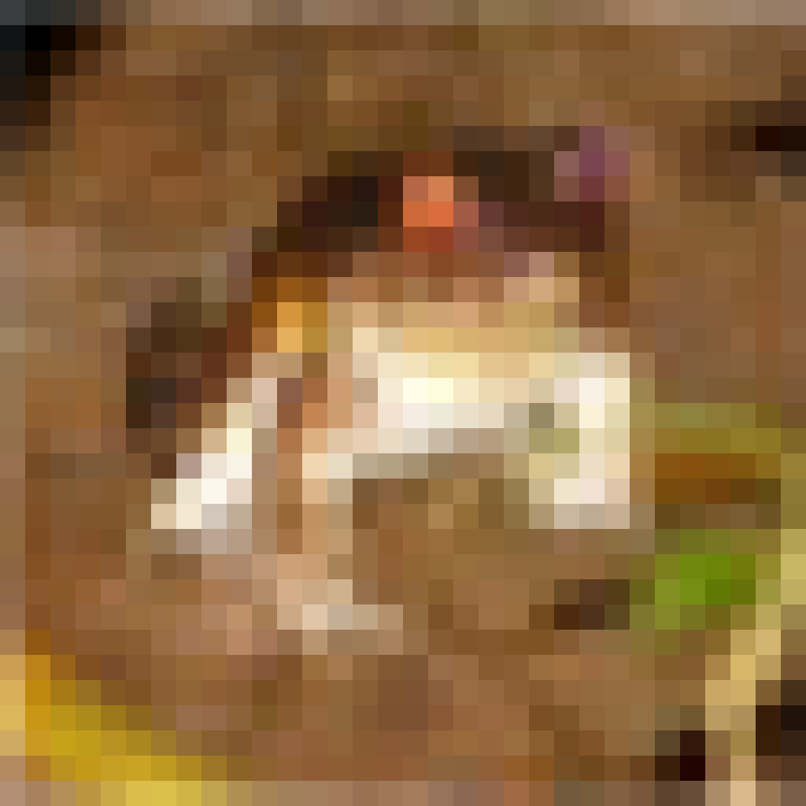
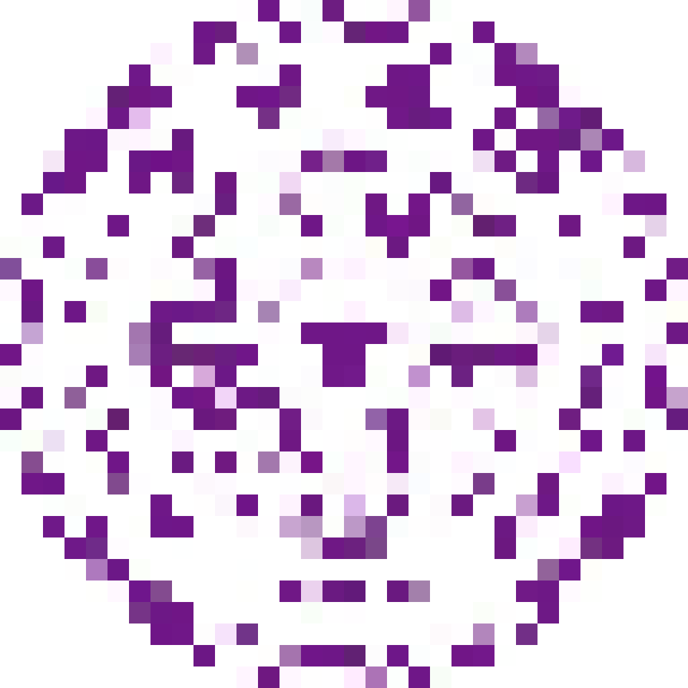

# PatchBackdoor
The PatchBackdoor codebase is associated with the paper titled '**PatchBackdoor: Backdoor Attack against Deep Neural Networks without Model Modification**'.
### Prerequisite
* tqdm==4.63.0 
* torch==1.11.0
* torchvision==0.12.0

We have not tested our code with other versions of torch/torchvision. However, since we do not utilize some sensitive functions from torch, it is likely that close versions will work as well. In most cases, as long as you can run
```python
import torch
a=torch.rand((3,224,224),device='cuda')
```
, it is highly likely that your environment will be able to run our code successfully
### Example Usage
* simply running 
```bash
python TrainPatchCifar10.py
```
should work. It will keep printing the data of training. An example of data is shown below:
```
train loss: 
38614.067; 55173.612; sumLoss: 93787.679
train Top1: 
0.82;  0.87;  
vali Top1: 
0.78;  0.87;  
raio:
1.00;  1.21;    
```
The first column includes the clean accuracy and its corresponding ratio, while the second column represents the attack success rate and its ratio. For more information on ratios, please refer to the comment in PatchTrainer.

Running the code will generate a file named 'result.report'. By loading this file using torch.load, you will be able to view details such as the patch, trained model, testing data, and more
### Data preparation (Optional)
1. Download Imagenette from https://github.com/fastai/imagenette. Or precisely https://s3.amazonaws.com/fast-ai-imageclas/imagenette2-320.tgz
2. If you are Windows user, simply unzip it with Bandizip or any other unzip tools
3. If you are Linux or mac user, 
```bash
tar -zxvf imagenette2-320.tgz
```
should work. Please remember the directory of dataset.
### Content 
* Transformations 
* Training and Testing
* Examples
#### Transformations(PatchApply.py)
* The code is stored in PatchApply.py
* Then we are going to explain every single function in PatchApply.py
##### PatchOnlyProtocol
* This function basically resize *pic* with specified *resize* parameter and places it in the bottom right corner, 
covering the corresponding area on the *patch*.
* In other words, the bottom right part of the patch is useless.
* For example, if *pic* is
<p >
  
</p>

* And the *patch* is  
<p >
  
</p>
* And the *side*=8, then the result will be
<p >
  
</p>
* In that case, the corresponding *resize* would be

```python
import torchvision.transforms

torchvision.transforms.Resize((24,24))
```
* Note the 24 comes from 32-8
##### PatchAndTriggerProtocol
* This function adds a trigger on the patched image.
* Therefore, the *pic*,*patch*, and the *patchOnly* are just used to generate patched image. They are called as follows:

```python
patchedImage=patchOnly(pic,patch)
```
* Then it covers the trigger on the patched image.
* the position of trigger is given by x,y, corresponding to its top left corner.
##### getTransformations
* This function return two functions of patchOnly and patchAndTrigger.
* As mentioned in Section 4 in the paper, it applies trigger close to the patch. 
We have also discussed its influence in Section 4.4 in paper.
<p >
  
</p>

* The *picSize* is just the width of the image we are about to evaluate on.
    * we assume the pic is a square. If not, please use resize transformation.
* The *patchSide* is mentioned in the image.
* The *trigger* could be a chosen image (which is a tensor) 
or an int indicating the trigger width (in that case, the trigger will be a white block) which is shown in the image above.

#### Training and Testing(PatchTrainer.py)


# This is not finished yet, will be mostly finished before 2023/8/8!